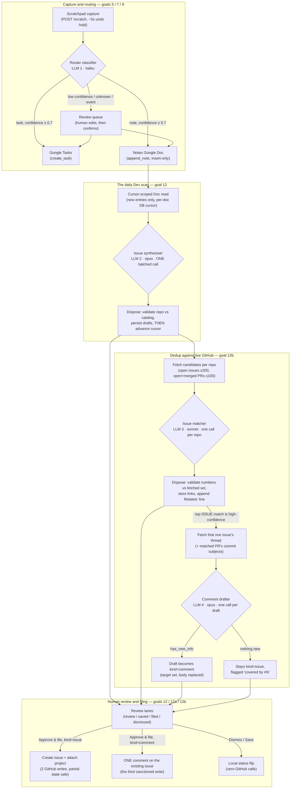
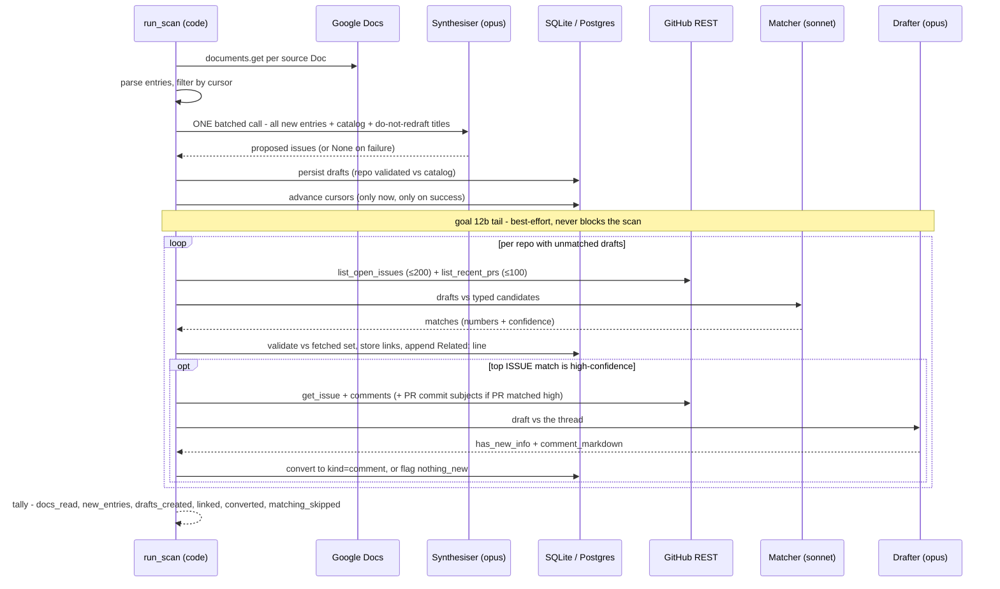
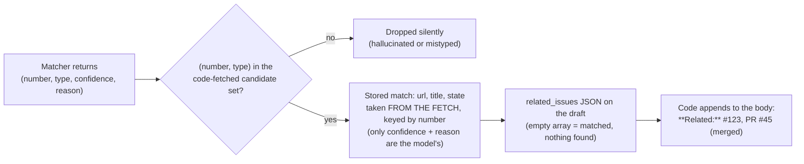
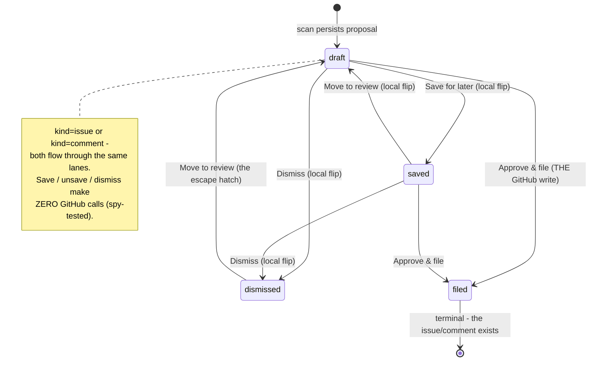

# The Dev pipeline: from a captured thought to a GitHub issue (or a comment)

*Architecture reference — goals 5, 7, 9/10, 12, 12a, 12b. Last updated 2026-08-20.*

This document traces the full life of an engineering thought through the dashboard: typed
into the scratchpad, routed into a meeting-notes Google Doc, synthesised into a
de-duplicated GitHub issue draft, checked against the issues and PRs that already exist in
its target repo, and finally filed by a human — either as a **new issue** or as a
**comment enriching an existing one**. It is written so a developer (or a curious
non-developer) can follow the whole chain without reading the code first.

**The one invariant that shapes everything:** every LLM step *proposes*; deterministic
code *disposes*. No LLM in this pipeline ever calls Google or GitHub, ever sees a Drive
id, a PAT, or a member login, and nothing an LLM returns is acted on until code has
validated it against something code itself fetched. The pipeline is a **workflow, not an
agent** — the control flow is fully known before any model runs (the decision and its
revisit triggers are recorded in [goal-12b.md](../goal-12b.md)).

---

## 1. The whole pipeline at a glance



Four LLM calls, each bounded and single-purpose:

| # | Step | Model (env knob) | Sees | Returns | Output budget |
|---|------|------------------|------|---------|---------------|
| 1 | Router classifier | haiku (`ROUTER_MODEL`) | The capture text (≤1200-char excerpt) + the notes hierarchy as **paths only** | `{destination, confidence, fields}` | 2048 |
| 2 | Issue synthesiser | opus (`DEV_MODEL`) | All new note entries (text + doc path + timestamp) + repo catalog + do-not-redraft titles | Proposed issues `{title, body, repo, sources[]}` | `DEV_MAX_TOKENS` = 32000, streamed |
| 3 | Issue matcher | sonnet (`DEV_MATCH_MODEL`) | Draft titles+bodies + candidate issue titles/labels + PR titles/states/excerpts | Per draft: `matches: [{number, type, confidence, reason}]` | `DEV_MATCH_MAX_TOKENS` = 16000, streamed |
| 4 | Comment drafter | opus (`DEV_MODEL`) | One draft + ONE issue's body + comments (+ matched PR metadata + commit subject lines) | `{has_new_info, comment_markdown}` | `DEV_COMMENT_MAX_TOKENS` = 8000, streamed |

What no LLM ever sees: Drive ids, folder ids, GitHub PATs, candidate URLs, repo member
logins. What no LLM output is ever trusted for: URLs, ids, repo names outside the
catalog, issue numbers outside the fetched candidate set.

---

## 2. Stage by stage

### Stage 1 — Capture (the scratchpad)

The dashboard's scratchpad (`CapturePanel`) is a free-text box: type a thought during a
meeting, press Shift+Enter. The entry is held behind a ~5-second **Undo** toast (undo
restores the text into the editor and nothing is ever sent), then `POST /scratch` stores
it as a user-scoped `scratch_entry` row.

Routing happens **inline in that same request** (goal 7c): the response already carries
the routed state, so a confident capture appears as a task or a filed note seconds after
you type it. Entries the inline pass leaves `UNROUTED` (a transient LLM error, say) are
retried by a backstop scheduler every ~15 minutes (`ROUTER_SCHEDULER_INTERVAL` = 900s).

### Stage 2 — Routing (LLM 1: the classifier)

`app/router/classifier.py` sends the capture (excerpted to `CLASSIFY_MAX_CHARS` = 1200 —
measured: showing the whole of a long capture makes the model burn its budget echoing the
body) to **haiku** with the user's notes hierarchy rendered as **paths only** — never
Drive ids. It returns a structured `{destination, confidence, fields}`:

- **`task`**, confidence ≥ `ROUTER_CONFIDENCE_THRESHOLD` (0.7) → `create_task` (+ an
  optional due-date reschedule). Insert-only blast radius: the router can never delete,
  complete, or overwrite anything.
- **`note`**, confidence ≥ 0.7 → the note is appended to the Doc whose **path** the model
  proposed; deterministic code maps path → stored Drive id (an unknown path falls back to
  review). This is the write the Dev pipeline later reads.
- **Anything else** — low confidence, `unknown`, `event` — goes to the **review queue**,
  where a human edits the fields and confirms. Nothing below the gate auto-writes.

The note write (`writes.service.append_note`) is **insert-only at the top of the Doc**,
guarded by a fail-closed folder-ancestry check (the Doc must live under the app-created
notes folder). Each entry lands in a fixed shape the Dev parser later keys off:

```
H3   <one-liner summary>            ← LLM-authored (goal 9)
H4   6-July-2026, 8:41 PM IST       ← code-authored timestamp, locked format (goal 10)
H5   auth, login                    ← optional LLM keywords
     <the captured text, verbatim>
     <blank line delimiter>
```

The body is always the user's words verbatim — the only LLM-authored lines are the
one-liner and keywords. Docs are newest-first; the H4 timestamp (minute-granular, IST
wall clock) is the ordering truth, never document position.

### Stage 3 — The daily scan (cron or "Create now")

Two triggers, one code path (`dev.service.run_scan`):

- **The scheduler** (`app/dev/scheduler.py`): an in-process asyncio loop ticks every 30
  minutes (`DEV_SCHEDULER_INTERVAL` = 1800s). A user is *due* when the IST clock has
  passed **21:00 (9 PM IST, `DEV_DAILY_HOUR_IST`)** *and* at least **20 hours**
  (`DEV_DAILY_MIN_HOURS`) have elapsed since their last scan — so in practice the scan
  fires **once a day, between 9:00 and 9:30 PM IST**. End-of-day on purpose: whole-day
  synthesis wants the day's mentions together.
- **Create now** (`POST /dev/scan-now`): the after-a-meeting affordance. Same function,
  bypasses the cadence entirely.

Cost gating comes first, before any credentials load or token is spent: the per-user loop
skips anyone without the `dev` feature flag (a per-user flag on `allowed_email.features`)
and anyone whose config is incomplete (no GitHub token, no source Doc, no target repo).

**Source resolution:** the Dev config stores notes-hierarchy *node ids*, resolved at scan
time against the live hierarchy index into concrete Doc leaves — selecting a folder means
"every Doc under it, forever", so a Doc created next week under a selected folder is
picked up automatically. Ids always come from the stored index, never from LLM output.

**The cursor:** per `(user, doc)`, a DB row (`dev_doc_cursor`) remembers the newest entry
timestamp already processed plus the *boundary keys* — the entries at exactly that minute
already consumed (timestamps are minute-granular and batch pastes share one, so
"strictly newer" alone would drop a same-minute entry captured after a scan). A scan
keeps entries strictly newer than the cursor plus same-minute entries not in the
boundary. **No marker is ever written into the Doc** — the Doc stays insert-only and
there is nothing for a human to accidentally delete. Crucially, the cursor **advances
only after drafts persist**: a crash (or a failed synthesis) between the LLM and the
store means the same entries simply re-scan next run. Nothing is ever silently consumed.



### Stage 4 — Synthesis (LLM 2: the opus synthesiser)

All new entries across **all** source Docs go into **one batched call** — this is the
step that recognises that "login broke" in standup and "auth failing" written after a 1:1
are the *same* latent issue, and merges them into a single draft citing both entries in
`sources`. Cross-conversation synthesis is why this call defaults to opus.

The prompt contains exactly (`ENTRY_FIELDS`, pinned by a guardrail test):

- per entry: `{doc_path, entry_ts, one_liner, keywords, body}` — the service threads
  `doc_id` alongside for provenance, but it is never serialized;
- the repo catalog `{full_name, description}` — the description is the one hand-typed
  field, written by the owner to steer repo picks;
- the **do-not-redraft list**: titles of up to 60 (`DO_NOT_REDRAFT_LIMIT`) still-open or
  filed drafts, the app-local cross-scan dedup.

The call **streams** with a 32k output budget — a first-run backlog once truncated at
8192 tokens and the cut-off JSON parsed to zero drafts (commit `5c6b48e`); streaming plus
an explicit `max_tokens` stop-reason check turned "truncated" into an honest failure.
**Failure semantics matter here:** a returned result (even an empty one — "nothing worth
drafting") advances the cursor; a `None` (error or truncation) holds the cursor so the
whole batch retries next scan. The scan tally reports which one happened.

**Dispose** (`_dispose_synthesis`): each proposed issue's `repo` is validated against the
configured catalog (out-of-catalog → the default repo — never filed to an unconfigured
repo); titles and bodies are stored **verbatim as drafts**; the repo's default ProjectsV2
project is preselected; provenance rows map back to Doc ids via the path map code built.

### Stage 5 — Dedup against live GitHub (goal 12b)

Everything up to here dedups only against the app's own memory. This stage checks what
**actually exists on GitHub** — issues filed by hand, by teammates, or before the
pipeline existed.

**Scope: the whole unfiled backlog, once per draft.** The matcher targets every
non-settled draft (statuses `draft` and `saved`) whose `related_issues` column is still
NULL — regardless of which scan created it. Dismissed and filed drafts are never matched;
a draft that has been matched (even to an empty `[]`) is never re-matched. Changing a
draft's repo resets its matches to NULL (they were judged against the wrong repo's
candidates), so the *next* scan re-matches it — there is no live re-match.

**Candidate fetch (code):** per repo with unmatched drafts, using the owner-routed PAT:

- `list_open_issues` — `GET /repos/{o}/{r}/issues?state=open&sort=updated`, capped at
  `DEV_ISSUE_FETCH_CAP` (200) most-recently-updated. Open state deliberately, **not** a
  recency window: a six-month-old open issue is exactly the duplicate that matters. The
  endpoint interleaves PRs (rows with a `pull_request` key — a classic gotcha); those are
  filtered out. Kept fields: number, title, labels, url, updated_at. No bodies fetched.
- `list_recent_prs` — `GET /repos/{o}/{r}/pulls?state=all&sort=updated`, capped at
  `DEV_PR_FETCH_CAP` (100), keeping **open and merged** and skipping closed-unmerged
  (abandoned). The list response already carries each PR's body, truncated code-side to a
  ~400-char excerpt — PR candidates cost zero extra calls.

**The matcher (LLM 3, sonnet, one call per repo):** sees that repo's unmatched drafts
(positional index + title + body — never the DB id) against the typed candidates (issues
as number/title/labels; PRs as number/title/state/excerpt). No URLs, no tokens. It
returns, per draft, `matches: [{number, type, confidence, reason}]`, streamed with its
own 16k budget so the first post-deploy backlog pass cannot truncate.

**Dispose (code):**



The stored `related_issues` is what the card renders — and because every URL in it came
from GitHub's own list response, the card can safely render them as real anchors. A repo
with zero candidates skips the LLM entirely and marks its drafts matched-empty.

**Best-effort, always.** A failed candidate fetch, a matcher error, a truncation — any of
these skips *that repo* for *this scan*: drafts stay plain issue drafts with NULL
matches (so they retry next scan), the cursor is untouched (it advanced back in stage 4),
and the tally says `matching_skipped` rather than hiding it.

### Stage 6 — Convert to a comment (LLM 4: the drafter)

Only when a draft's top **issue** match is **high** confidence (PRs are never comment
targets — a PR-only match stays a linked issue draft):

1. Code fetches that ONE issue's body and its newest ~50 comments — the first time any
   issue body is read. If a PR also matched high, code fetches that PR's **commit subject
   lines** (first line of each message, ≤30) — the ceiling of PR content the app ever
   reads: never diffs, patch bodies, review threads, file contents, or CI status.
2. The drafter (opus — this text will face humans on GitHub) judges: *does the draft
   carry anything the thread doesn't already have?*
   - **Yes** → `{has_new_info: true, comment_markdown}`. Code mutates the draft:
     `kind = "comment"`, `target_issue_number`/`target_issue_url` set **from the
     validated match** (never from the LLM), body **replaced** by the comment markdown
     (explicit owner sign-off — the original body is superseded; the title survives for
     display and the do-not-redraft list), project preselect cleared. Secondary matches
     (the PR) stay in a `Related:` line inside the comment; the target issue itself is
     excluded (a `#N` inside a comment on #N is noise).
   - **No** → the draft stays `kind = "issue"`, its top match flagged
     `nothing_new: true`. The card reads "covered by #N — nothing new to add" and waits.
     **Nothing is ever auto-dismissed** — drafts are cheap, filing is sacred, and the
     dismiss click is the human's.

Any failure in this stage (thread fetch, drafter error) leaves a linked issue draft —
conversion is a bonus, never a blocker.

### Stage 7 — Human review and filing

Drafts land in the Dev view's four lanes (goal 12a) — **In review** (drains by infinite
scroll), **Saved for later**, **Filed**, **Dismissed** (bounded pages + "Load older") —
paged by a keyset cursor over `(updated_at, id)` so mid-scroll arrivals never shift rows.



Every card is editable while pending (title, body, and — for issue drafts — repo and
project). Card affordances added by 12b:

- **The Similar line** — the validated matches as real anchors (`#123 title ↗`,
  `PR #45 (merged) title ↗`), each opening in a new tab. This is the clickable pre-file
  affordance: the body's `Related:` text line lives in a plain textarea and only becomes
  a link once filed on GitHub.
- **The comment badge** — a comment card's header reads "Comment on {repo}#{n} ↗" and its
  repo/project dropdowns are hidden (the target is fixed; re-targeting a comment means
  dismissing it — the API enforces this with a 409).
- **@-mention typeahead** — typing `@` in the body offers the repo's assignable logins
  (`GET /dev/config/members?repo=`, backed by GitHub's assignees endpoint, cached per
  repo per session; a PAT that can't list assignees degrades to an empty list). Picking
  one inserts **plain `@login` text** — GitHub linkifies and notifies on filing. Member
  logins are never included in any LLM payload, so no model can ping a real person.

**Filing** (`POST /dev/{id}/file` → `service.file_draft`) is the only path to a GitHub
mutation, and it branches on `kind`:

| | `kind = "issue"` | `kind = "comment"` |
|---|---|---|
| Write(s) | `POST /repos/{o}/{r}/issues`, then `addProjectV2ItemById` (GraphQL) | `POST /repos/{o}/{r}/issues/{n}/comments` — exactly one |
| Failure handling | Partial-state idempotent: the issue number/url is stored the moment creation succeeds, so a failed project-attach retries **only** the GraphQL step — never a double-create | Single write: failure leaves the draft untouched (status still `draft`) for a retry click; an already-stored comment URL is never re-posted |
| Stored on success | `issue_url` / `issue_number` / `issue_node_id`, `status=filed` | The **comment's** html_url in `issue_url`, the target's number in `issue_number`, `status=filed` |

The complete GitHub write set is exactly three calls — create issue, attach to project,
comment on issue — and **comments are the only mutation the app ever applies to a
pre-existing GitHub object**. It never edits an existing issue's body, labels, state, or
assignees, and never comments on a PR.

---

## 3. Security posture (the boundaries, in one table)

| Boundary | Rule | Enforced by |
|---|---|---|
| LLM ↔ Google | No LLM reads or writes Google. Reads are direct API calls; the only routed writes are insert-only (`create_task`, `append_note`) | Module layering; AST test pins the Docs call surface |
| LLM ↔ GitHub | No LLM calls GitHub or sees the PAT. All GitHub I/O is in `github.py`, called only by `service.py` | `synth.py` never imports `dev.github`; spy tests |
| LLM ↔ ids/URLs | Doc ids, candidate URLs, issue numbers: code fetches them, code validates model references against the fetched set, stored values come from the fetch | Pinned-fields tests (`ENTRY_FIELDS`, `DRAFT_MATCH_FIELDS`, …); bogus-number dispose test |
| LLM ↔ people | Member logins never enter any LLM payload; mentions exist only if the owner typed or picked them | Pinned-fields tests; the members list serves only the editor typeahead |
| Secrets | GitHub PATs: fine-grained, one per resource owner, Fernet-encrypted at rest, write-only through the API (masked on read), routed by target repo owner at call time | `dev_pat` table; config API returns only masked hints |
| Google scope | `drive.file` only — the app touches only files it created; the note write runs a fail-closed folder-ancestry gate | Startup scope assertion; ancestry check; ADR `drive-access-scoping.md` |
| Access | The `dev` feature flag gates the UI rail, every `/dev/*` endpoint (403), **and the cron's per-user loop** — an unflagged user never costs a Doc read or an LLM token | `require_dev_enabled`; scheduler cost gate |
| Blast radius | Human-gated writes only; no bulk approve, no auto-file, no auto-dismiss; every non-filing transition is a local status flip with zero GitHub calls | Spy tests on every flip |

**Why not an agent?** Every tool call in this pipeline is predictable from the previous
step's output — fetch candidates, judge, fetch the one matched thread, judge again,
dispose. An agent earns its keep only when the model must *choose what to look at next*
based on what it just found. Recorded triggers that would reopen the decision: match
quality degrading once a repo outgrows the fetch cap; matching needing to follow
cross-references ("duplicate of #123"); comment drafting needing to consult long threads
selectively rather than reading them whole.

---

## 4. Ops reference

### Cadence

| Loop | Interval | Fires when |
|---|---|---|
| Router backstop | 15 min (`ROUTER_SCHEDULER_INTERVAL`) | Any `UNROUTED` scratch entries (inline routing is the normal path) |
| News (for contrast) | daily | — |
| **Dev scan** | tick every 30 min (`DEV_SCHEDULER_INTERVAL`) | IST hour ≥ **21** (`DEV_DAILY_HOUR_IST`) **and** ≥ 20h since last scan (`DEV_DAILY_MIN_HOURS`) → effectively **once daily, 9:00–9:30 PM IST**. `Create now` bypasses the cadence |

### Env knobs (dev module)

| Knob | Default | What it bounds |
|---|---|---|
| `DEV_MODEL` | opus | Synthesiser + comment drafter (human-facing text) |
| `DEV_MAX_TOKENS` | 32000 | Synthesiser output (streams; raise for a huge first backlog) |
| `DEV_MATCH_MODEL` | `claude-sonnet-5` | The matcher |
| `DEV_MATCH_MAX_TOKENS` | 16000 | Matcher output (streams) |
| `DEV_COMMENT_MAX_TOKENS` | 8000 | Comment drafter output |
| `DEV_ISSUE_FETCH_CAP` | 200 | Open-issue candidates per repo |
| `DEV_PR_FETCH_CAP` | 100 | PR candidates per repo |
| `DEV_DO_NOT_REDRAFT_LIMIT` | 60 | Titles fed to the synthesiser as app-local dedup |
| `DEV_DAILY_HOUR_IST` / `DEV_DAILY_MIN_HOURS` | 21 / 20 | The daily window |
| `DEV_SCHEDULER_ENABLED` | 1 | Kill switch for the loop |

### Failure modes (what breaks → what happens → what you do)

| Failure | Behaviour | Operator action |
|---|---|---|
| A source Doc fails to read | That Doc is skipped; others proceed; its cursor untouched | Nothing — next scan retries |
| Synthesis errors or truncates | `None` → **no drafts stored, no cursor advanced**; tally says `synthesis failed … will re-scan` | Nothing (or raise `DEV_MAX_TOKENS` if it keeps truncating) |
| GitHub candidate fetch fails | That repo's match phase skipped; drafts persist with NULL matches; tally says `match check skipped` | Nothing — next scan retries the NULL drafts |
| Matcher errors or truncates | Same as above, per repo | Nothing (or raise `DEV_MATCH_MAX_TOKENS`) |
| Thread fetch / drafter fails | Draft stays a linked issue draft (no conversion) | Nothing |
| Issue filing: create OK, project-attach fails | `filed` with "attach pending"; retry re-runs only the attach | Click retry on the card |
| Comment filing fails | Draft untouched, still `draft` | Click Approve & file again |
| PAT missing for a repo's owner | Filing blocked with `no_token_for_owner`; matching for that repo skipped | Add a token for that owner in Dev config |

### First deploy with an existing backlog

The 12b migration (`d4e5f6a7b8c9`) backfills every existing draft with `kind="issue"` and
`related_issues = NULL`. NULL is the matcher's work queue — so **the first scan after
deploying processes the entire lingering backlog**: every review + saved draft gets
matched, linked, and (where a high-confidence issue match carries new info) converted to
a comment draft. That first scan runs one matcher call per distinct repo in the backlog
and one drafter call per conversion; the tally reports
`N linked …, M converted …`. Nothing fires at deploy time itself — the work happens on
the next scan, whether that's a manual **Create now** click or the 9 PM IST cron,
whichever comes first. If a repo's call fails or truncates that day, its drafts simply
stay NULL and retry the next scan. (Side benefit: draining the backlog un-saturates the
60-title do-not-redraft list, restoring cross-scan dedup headroom.)

---

## 5. Code map

| Concern | Where |
|---|---|
| Scratchpad capture + review queue | `backend/app/router/` (`service.py`, `models.py`), `frontend/src/panels/` CapturePanel |
| Router classifier (LLM 1) | `backend/app/router/classifier.py` (contract: `.claude/rules/router.md`) |
| Note write (insert-only) | `backend/app/writes/service.py` (`append_note`, `format_note_heading`) |
| Notes hierarchy index | `backend/app/settings/notes_index.py` |
| Doc parsing (entry shape) | `backend/app/dev/parser.py` |
| Scan orchestration + dispose + filing | `backend/app/dev/service.py` (`run_scan`, `_match_and_convert`, `file_draft`) |
| LLMs 2–4 (synthesiser, matcher, drafter) | `backend/app/dev/synth.py` (schemas in `schema.py`) |
| GitHub client (all HTTP, 3 writes + 6 reads) | `backend/app/dev/github.py` |
| Cursor + drafts + PAT models | `backend/app/dev/models.py` |
| Daily scheduler | `backend/app/dev/scheduler.py` |
| HTTP surface | `backend/app/routers/dev.py` |
| Dev view UI | `frontend/src/dev/` (`DevView.tsx`, `useDevPanel.ts`, `draftTabs.ts`, `similar.ts`, `mentions.ts`, `scanTally.ts`) |
| Contracts / rules | `.claude/rules/dev.md`, `.claude/rules/router.md` |
| Goal briefs | `docs/goals/goal-5.md`, `goal-7*.md`, `goal-9.md`, `goal-10.md`, `goal-12.md`, `goal-12a.md`, `goal-12b.md` |
